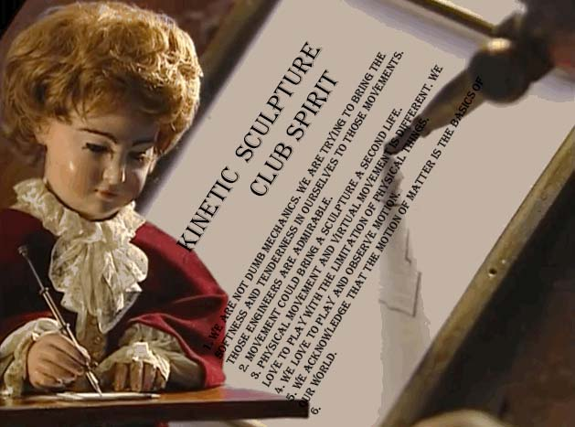

this extraordinary little doll is actually a self-operating machine that's believed by some to be one of the oldest examples of a computer. Known as “The Writer,” the automaton was built by Swiss-born watchmaker Pierre Jaquet-Droz in order to entertain nobility and promote watches. 

#### Club Spirit
1. We are not dumb mechanics. We are trying to bring the softness and tenderness in ourselves to those movements. Those engineers are admirable.
2. Movement could bring a sculpture a second life.
3. Physical movement and virtual movement is different. We love to play with the limitation of physical things.
4. We love to play and observe motion.
5. We acknowledge that the motion of matter is the basics of our world.
6. 