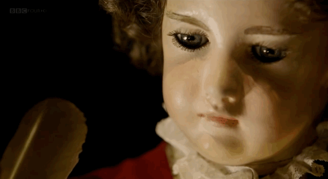

this extraordinary little doll is actually a self-operating machine that's believed by some to be one of the oldest examples of a computer. Known as “The Writer,” the automaton was built by Swiss-born watchmaker Pierre Jaquet-Droz in order to entertain nobility and promote watches. 

### Club Spirit
1. We are not dumb mechanics. We are trying to bring the softness and tenderness in ourselves to those movements. Those engineers are admirable.
2. Movement could bring a sculpture a second life.
3. Physical movement and virtual movement is different. We love to play with the limitation of physical things.
4. We love to play and observe motion.
5. We acknowledge that the motion of matter is the basics of our world.
6. Motion is honest, it can not lie
7. (each person will contribute at least one sentence to it)

### World Sculpture Racing Society

SCULPTURE RACING IS FUN
SCULPTURE RACING IS SERIOUS
SCULPTURE RACING IS HIGHBROW ART
SCULPTURE RACING IS KITSCH
SCULPTURE RACING IS ABSURD
SCULPTURE RACING IS PROFOUND
SCULPTURE RACING IS OBVIOUS
SCULPTURE RACING IS PARADOXICAL
SCULPTURE RACING IS A FAD
SCULPTURE RACING IS AN ENDURING CONTRIBUTION TO THE HISTORY OF WESTERN CIVILIZATION

SCULPTURE RACING is kinetic art in which both artwork and mover are perceived as one; sculpture races are dynamic groupings of art objects and personalities

SCULPTURE RACING exists in the zone between high art and mass culture; it is moveable art that may appear anywhere, not necessarily where one expects it

SCULPTURE RACING takes art out of the galleries and museums and into the streets

SCULPTURE RACING blends art with the ambience of the popular festival, making it more accessible to the general public

SCULPTURE RACING brings artists out of the isolation of the studio and into public: it brings the public into contact with artist-as-personalities in an atmosphere that is relaxed and open, allowing an easy give-and-take

SCULPTURE RACING offers artists relief from the uncertainties of subjective criticism and art historical evaluation by giving them the clear-cut winner, loser, first, second, third place ranking enjoyed by athletes

SCULPTURE RACING embraces the competitiveness of the modern art world that compels artists to throw themselves into promotion, mass marketing and popular appeals

SCULPTURE RACING is the focus of a protest against the new political conservatism with its accompanying cuts in social programs and funding for the arts, the results of which have engaged artists in all media in a desperate race for survival

SCULPTURE RACING is an art of social-aesthetic dialectics:

Ultimately the “Art of Sculpture Racing” per se will not reside in individual art objects—not even in individual sculpture races—but rather….
