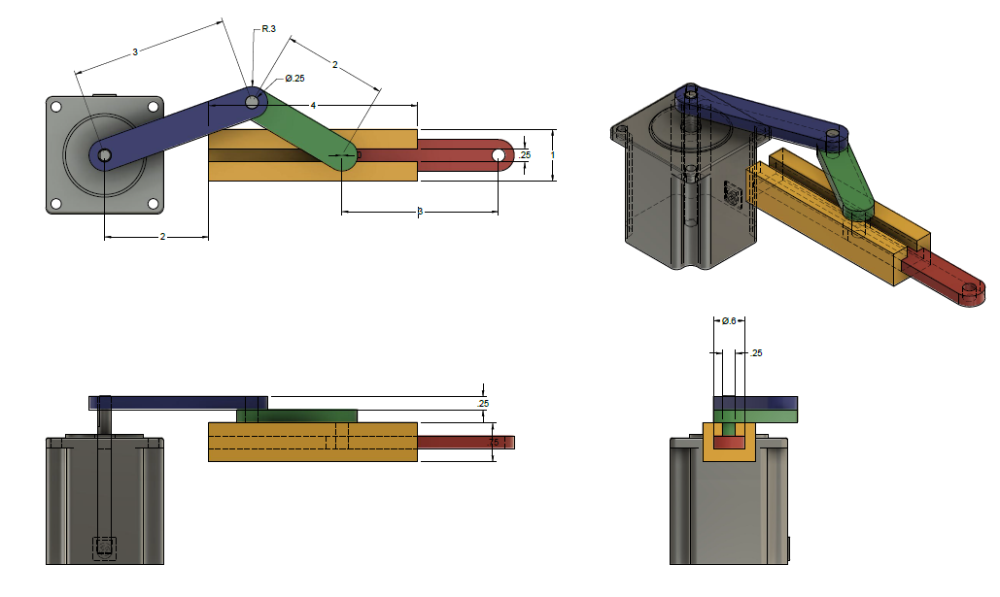

## **Fusion 360 workshop**

---

### **Fusion 360 download**

[Link](https://www.googleadservices.com/pagead/aclk?sa=L&ai=DChcSEwijgcj8p5r2AhUSicgKHRQNAAoYABADGgJxdQ&ei=poIYYrrgGb_YytMP75ynqAY&ohost=www.google.com&cid=CAASEuRo9_AnOZVRNGLZZcOEryXrqw&sig=AOD64_3RAT7U_e18LkS9mZQE5FdGtXto6Q&q&sqi=2&adurl&ved=2ahUKEwi6y7_8p5r2AhU_rHIEHW_OCWUQ0Qx6BAgDEAE)

get free trial with educational license.

### **Zoom, Pan and Orbit**

**middle mouse button**

- Zoom: roll the middle mouse button or Ctrl + Shift + middle mouse button.

- Pan: middle mouse button.

- Orbit: Shift + middle mouse button.

## First Mission:

---

[Drawings download pdf](https://drive.google.com/file/d/1QnRcQCTb9DUuG8Rdvz84DLR4pkwzOBKH/view?usp=sharing)

### **Create a bar**

- everytime you draw a sketch, you need do define the sketch plane

- Q for extrusion shortcut

- pin the dimension tool cause it is useful

### **Body and Component**

When we do assembly, we should make everything a component

### **Paste and paste new**

Paste: add an instance

Paste New: add another instance

edit the second bar

### **insert Mcmaster Component**

6627T53_Position-Control DC Motor

& ground the component

### **revolute joint**j

J is the shortcut for joint

create 2 revolute joints

### **Activate and Isolate**

Activate an object would activate the timeline of a component

Create the sliding groove

### **toggle colorful mode**

Shift+N, or inspect toogle component color cycling mode.

### **Align objects**

Modify, Align.. We usually align things first and then move it to get the right position.

### **Joint && As-built Joint**

Joint: When the parts are not in right position & when it is easy to dimension the joint

As-built joint: When you already align every components and just want to make a joint without any potential translate

### **Timeline**

By default Fusion will capture every change made to your design in a tieline. This process is called Parametric Modeling and is great when you need to capture specific features and define the relationship between parts.

Turning off design history allows you to work in a Direct Modeling environment. This lets you quickly create geometry without having to worry about individual features.

### **Joint Origin**

Center point square, Middle point triangle, snap

Hover over the face and press control/command on mac

### **joint limits & rest & suppress joint**

### **animate joints and animate models**

### **motion study**

&nbsp;

## **Mission Two：create gears in Fusion 360**

---

### **motion link**
