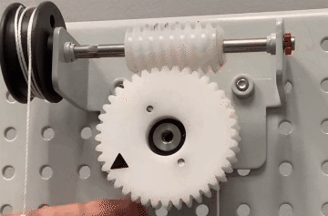

### Type of Gears

Spur Gear

Pinion

Internal Gear

Angular gear

Bevel Gear

**Worm Gear**

Not great for energy efficiency (28%)

can only be driven from the shaft side

 

images credit to [here](https://youtu.be/pfRFXhXQRgA)

Question: why music boxes use worm gears?