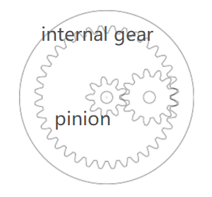
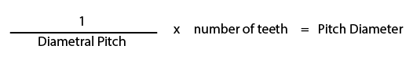

## Type of Gears

---

**Spur Gear**

Spur gears or straight-cut gears are the simplest type of gear

**Pinion**

A pinion is a round gear—usually the smaller of two meshed gears—used in several applications, including drivetrain and rack and pinion systems.

**Internal Gear**

**Rack**

a type of linear actuator that comprises a circular gear (the pinion) engaging a linear gear (the rack)

**Bevel Gear**

to turn the rotationl movement to another axis.

**Worm Gear**

can only be driven from the shaft side

 

Question: why music boxes use worm gears?

## Simulate in Fusion 360

---

[fm gear download and install](https://apps.autodesk.com/FUSION/en/Detail/Index?id=6294804001663532834)

The higher the pressure angle, the higher the tooth strength. A lower pressue angle gear has less noise. A bigger contact ratio lowers the noise. Decreasing the pressure angle and/or increasing the tooth depth can produce a larger contact ratio.

**Task one:**

transmit rotational movement from A to B. 

**Task Two:**

same shaft, one disk is rotating clockwise while another one is rotating counter-clockwise

Credit: 
wormwheel images credit to [here](https://youtu.be/pfRFXhXQRgA) [worm Gear](https://upload.wikimedia.org/wikipedia/commons/thumb/c/c3/Worm_Gear.gif/220px-Worm_Gear.gif)