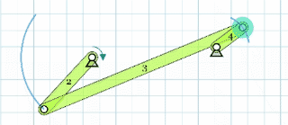
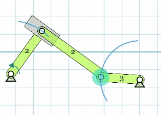
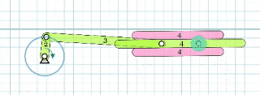
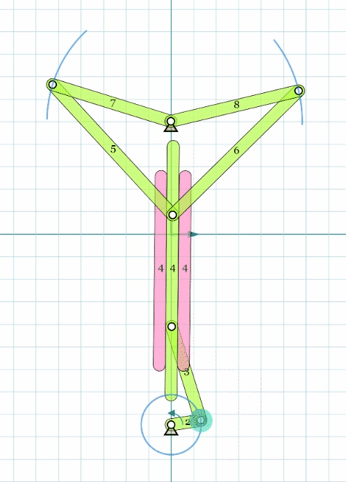

**Our goal of this session:**

Nerd Warning!!!

**our tool:**

I love [Motiongen](http://motiongenpro.appspot.com/).. it saves me a lot of time.

&nbsp;

## **Terms.. The code of linakges**

---

- **Fixed pivot and Moving Pivot**

- **R**

the revolute, or hinged

- **P**

the prismatic, or sliding

- **Degree of Freedom**

- **Crank and Coupler**

&nbsp;

## **Four Bar Linkage**

---

Assignment: Create a four bar linkage! in MotionGen (http://motiongenpro.appspot.com/).

Four bar linkage is everywhere!

[lulu's tic-toking machine](https://www.lulyu.me/work/tictoking)

[Four Bar Linkage Explain](https://youtu.be/Vh8r_Cpfb8Q)

Why?

[Grashof's Law](https://youtu.be/h8bz4ni6mdY)

&nbsp;

### **if we made some small adaptations to four bar linkages**

- Four bar linakge is a **RRRR**

- **RRRRR**

Add another driven R.

- **RPRR**

- **RRRP**

### **Combination**

- **RRRR+RRRP**

- RRRPRRR

- RPRR+RRRR

[placing a cube](https://youtu.be/IJASpyZ_vtY)

- 2 bar between 2 driven points

### **Using lever**

- **REVERSE MOTION LINKAGE**

- **PARALLEL MOTION LINKAGE**

&nbsp;

## Artwork Analyse

[bob potts pursuit](https://vimeo.com/99242581)

Look at the video and analyse the linkage system.. rebuild it in Motiongenpro.

&nbsp;

## Famous linkage Examples...

---

### **The Peaucellier–Lipkin linkage**

The first planar linkage capable of transforming rotary motion into perfect straight-line motion

In Wikipedia there is [Mathematical proof of concept](https://en.wikipedia.org/wiki/Peaucellier%E2%80%93Lipkin_linkage)

### **The Holy 11 numbers**

[a science fiction article about this 11 numbers](https://clarkesworldmagazine.com/theodoridou_02_14/)

[STRANDBEEST](https://youtu.be/LewVEF2B_pM) by Artist Theo Jansen

### other things I found interesting

[Linkage can draw all the curves mathematically... 中文视频 sorry I didn't find a better video in English](https://www.bilibili.com/video/BV18h411W78v?share_source=copy_web)

---
[Degree of freedom Formula] (https://en.wikipedia.org/wiki/Degrees_of_freedom_(mechanics))

reverse and parallel photos credit [here](https://technologystudent.com/cams/link1.htm)

## After Motiongen

---

How to overcome the nerd power from the interface and be creative?