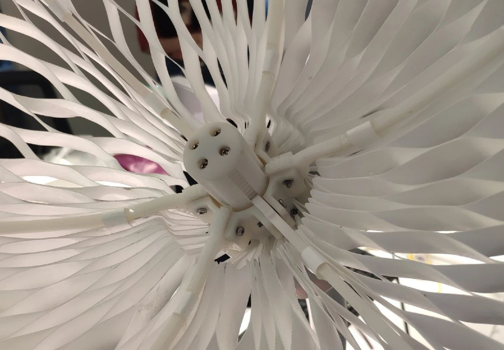
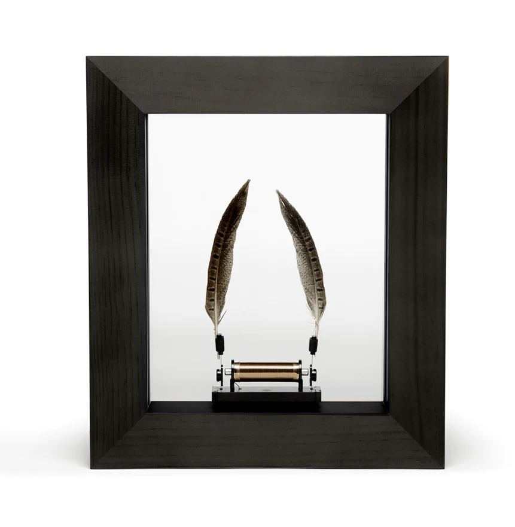

**1. GeeksArt**

[geeksart website](http://geeks-art.com/)

GeeksArt is a company located in Guangzhou, China for interactive art installations. I worked for them before. This is a piece they made called flower shadow.

They shared all their design in [this article](https://mp.weixin.qq.com/s/gKt27YElE8TRk7kXCuF0TA), giving credit to their designer Wei Lin, Keying Xie, Water(SHuifen) Chen.

**2. studio drift**

[Meadow website](https://studiodrift.com/work/meadow/)

I love this piece but never saw it in person. Let me know if you had seen it in person!!!

**3. Casey Curran**

Casey is a kinetic artist using paper to create nature of movements.

[Casey's website](https://www.caseycurran.com/)

**4. Choe U Ram**

Choe U Ram is another kinetic artist that I admire a lot. His flowers look delicate.

[video link](https://zh-cn.facebook.com/parasolprojects/videos/una-lumino-portentum-2008-by-korean-artist-u-ram-choe-the-graceful-robotic-sculp/920239471448322/)

**5. slow dance**

[slow dance](https://wondermachines.com/)

The flowers are not mechanical, but it use mechanism to create an interesting mvoement for real flowers.

**6. Others**

[flower mechanism](https://www.youtube.com/watch?v=6hGMEUKKNCE)

[flower mechanism](https://www.youtube.com/watch?v=pz5sigySlxk)

[flower mechanism](https://www.youtube.com/watch?v=HCqdY5u-Bic)