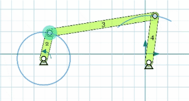
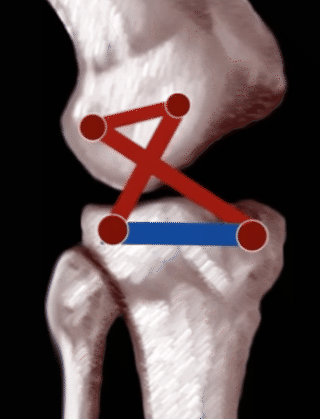
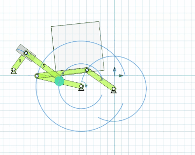

## things to say...

About me:

I am lu lyu, a kinetic artist and automata lover. 

My website: [lulyu's art](https://lulyu.me)

**Our goal of this session:**

**our tool:**

I love [Motiongen](http://motiongenpro.appspot.com/) a lot!

MotionGen is a planar mechanism design and simulation software part of SnappyXO Design suite of products developed by Stony Brook University and Mechanismic Inc. with the funding from the National Science Foundation via STTR Phase I and Phase 2 awards.

They also have their kits sold here: [SnappyXO](https://snappyxo.com/motiongen-shop/)

My personal workflow will be motiongen -> cardboard -> fusion 360

---

## **Terms.. The code of linkages**

- **Fixed pivot and Moving Pivot**

    

- **R**

    the revolute, or hinged

- **P**

    the prismatic, or sliding

- **Degree of Freedom**

    - dof=0
    - dof=1
    
    - dof=2
    

- **Crank and Coupler**

    

---

## **Assignment1:**

Create a four bar linkage! in [MotionGen](http://motiongenpro.appspot.com/).

---

## **Four Bar Linkage**

### what is four bar linkages?

Four bar linkage is everywhere!

[Four Bar Linkage Explain](c) a video showing different four bar linkages

[Grashof's Law](https://youtu.be/h8bz4ni6mdY) a video explaining a formula that would result in different behavior move of a four bar linkage

---

## getting advanced on linkage design

- Four bar linakge is a **RRRR**

- **RRRRR**

    Add another driven R.

    

- **RPRR**

    

- **RRRP**

    

### **Combination**

- **RRRR+RRRR**

    

- **RRRR+RRRP**

    

- **RRRPRRR**

    

- **RPRR+RRRR**

    

    [placing a cube](https://youtu.be/IJASpyZ_vtY)

- 2 bar between 2 driven points

    

### **Using lever**

- **REVERSE MOTION LINKAGE**

    

- **PARALLEL MOTION LINKAGE**

    

---

## **Assignment2:**

    Try to design a linkage system in motionGen

    - encourage a simple concept

    - hint: try to draw some shapes and attach shape to linkages

## inspirations

### **The Holy 11 numbers**

    [a science fiction article about this 11 numbers](https://clarkesworldmagazine.com/theodoridou_02_14/)

    [11 numbers](https://blogs.brighton.ac.uk/strandebeest/#:~:text=These%2C%20then%2C%20are%20the%20holy,walk%20the%20way%20they%20do.%E2%80%9D)

    a = 38, b = 41.5, c = 39.3, d = 40.1, e = 55.8, f = 39.4, g = 36.7, h = 65.7, i = 49, j = 50, k = 61.9, l=7.8, m=15 

    [STRANDBEEST](https://youtu.be/LewVEF2B_pM) by Artist Theo Jansen

### **The Peaucellier–Lipkin linkage**

    The first planar linkage capable of transforming rotary motion into perfect straight-line motion

    

    In Wikipedia there is [Mathematical proof of concept](https://en.wikipedia.org/wiki/Peaucellier%E2%80%93Lipkin_linkage)

### **Watt parallel motion**

    

### **bio inspired linkages**

    [linkage mechanisms in animal joints and related
    bioinspired designs pdf view link](https://iopscience.iop.org/article/10.1088/1748-3190/abf744/pdf)

    Why the beak of birds are curved and how birds could control the end of their beaks. [they controlled it by moving their maxilla](https://mp.weixin.qq.com/s/7DSoPQewo8s3DIHpvAY31w)

### Other linkage related artwork or examples

    [tickling fox](https://www.instagram.com/p/CaCvtcSgvwd/)

    [an automaton horse](https://youtu.be/YGoVssO3yEU)

    [Archer Automaton](https://youtu.be/YIuBXjywir0)

    [a flower clock](https://pin.it/2sREfee)

    [an ox](https://pin.it/zVMnTIs)

    [Tenfold](https://www.core77.com/posts/67529/Ten-Nifty-Linkage-Designs)

## CARDBOARD time

---

design a linkage system. Then prototype it with cardboard.

## Artwork Analyse

---

[bob potts pursuit](https://vimeo.com/99242581)

Look at the video and analyse the linkage system.. rebuild it in Motiongenpro.

My explaination video: [Linkof a video linkage design workshop 2](https://youtu.be/7FiIK0BkHbA)

## other readings

[Linkage can draw all the curves mathematically... 中文视频 sorry I didn't find a better video in English](https://www.bilibili.com/video/BV18h411W78v?share_source=copy_web)

[Degree of freedom Formula](https://en.wikipedia.org/wiki/Degrees_of_freedom_(mechanics))

reverse and parallel photos credit [here](https://technologystudent.com/cams/link1.htm)

## Discussion, Questions