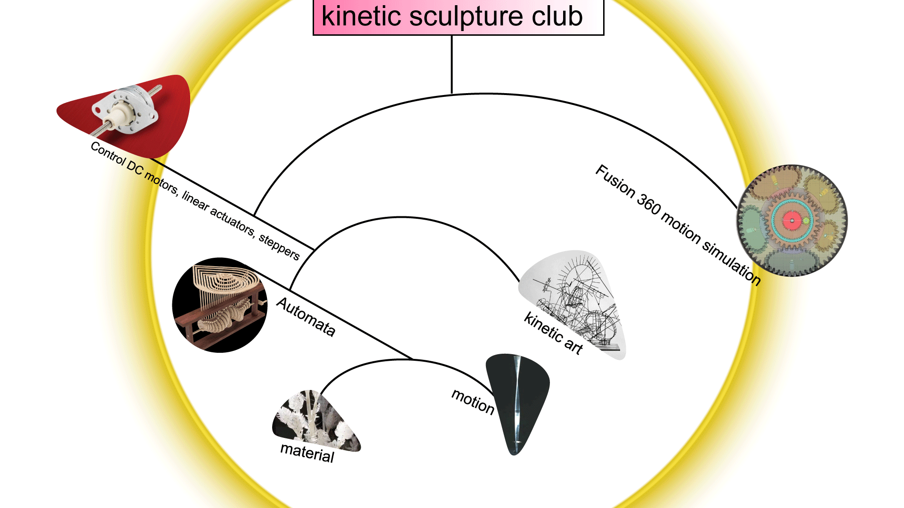

#### Schedule of Meeting

**1: Jan, 29, 2022, Intro to Kinect Sculpture Club**

introduce what is Kinetic Sculpture, What we made and schedule and club spirit.
If you want to receive emails about this club meeting please ***[fill in your email here](https://docs.google.com/spreadsheets/d/1_8TiYV4YC-upCKt304OQojFMGG0DDho1HfJRl6GY3YE/edit?usp=sharing)***!

**2: Feb, 11, 2022, Kinetic Art, a visit to David Rios's Office**

Slide: Kinetic Art, lulu would like to share pieces of artwork that blow her mind
Visiting David Rios's Office
For next Meeting: Share one piece of work / one artist that could show your field of interest related to this club. If you want to do a final project, think about the Final Project and share the idea next time.

**3: Feb, 19, 2022, Fusion 360 Simulation of Mechanism, Understanding gears**

[Slide for Sharing pieces of work you like](https://docs.google.com/presentation/d/1J7OCi2UwnFKZulq5AjOrl7CSz38PUzV7Y9OkxqNf8_s/edit?usp=sharing)
talk about the final project
For next Meeting: Share pieces of work you like... or your past kinetic project

**4: Feb, 26, 2022, Understanding Motors, Controlling High current devices, Controlling DC motors and Linear Actuators, Controlling Stepper Motors**

**5: Mar, 5, 2022, Automata and its Mechanism, Play with Mechanism using wires and cardboard, A glance at Mcmaster**

[Slide for Sharing pieces of work you like](https://docs.google.com/presentation/d/1J7OCi2UwnFKZulq5AjOrl7CSz38PUzV7Y9OkxqNf8_s/edit?usp=sharing)
talk about the final project

**6: Mar, 26, 2022, Generative Design, Guest Speaker**

[Slide: Material in kinetic art](https://docs.google.com/presentation/d/1C8GwCTfussdMojRNWRNiwoKI-sx_cPrYeFUIp9d8Z1M/edit?usp=sharing)

[Slide for Sharing pieces of work you like](https://docs.google.com/presentation/d/1J7OCi2UwnFKZulq5AjOrl7CSz38PUzV7Y9OkxqNf8_s/edit?usp=sharing)
talk about the final project

**7: Apr 2, 2022, Tips for finishing a project** 

Slide for better finishing a project
talk about the final project

**8: Apr 16 - Apr 23, 2022**

Showcasing all project in 1-2 phone booth for 1 week.

**9: Spring Show ...**