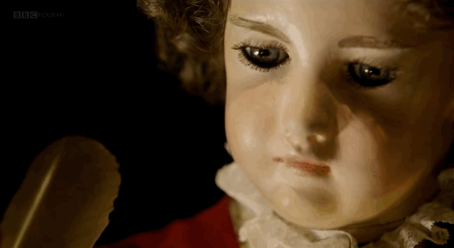
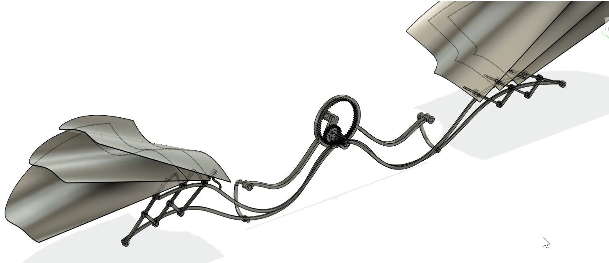
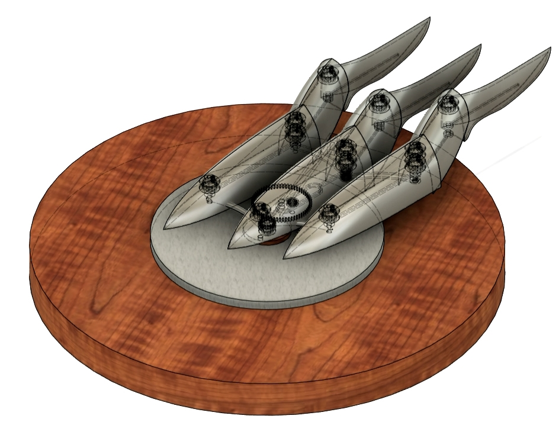

#### Schedule of Meeting

**1: Jan, 29, 2022, 1:00 pm - 2:30 pm, Intro to Kinect Sculpture Club**

[Slide](https://docs.google.com/presentation/d/14Gx4rb5BBoBIqE4TX549-QRHddT8LkuYYS29SPru7Ak/edit?usp=sharing)  introduce what is Kinetic Sculpture, What we made and schedule and club spirit.

There are so so so many great kinetic artists. Here is a list of artists that I found. [List](https://www.notion.so/30e6a2345652415abdf82babb003ed84?v=eab0870d39d64d0aa472fc74f6e8c2e6) !!!! Important!!!! Don't try to look at more than 10 artists at once!!!

If you want to receive emails about this club meeting please ***[fill in your email here](https://docs.google.com/spreadsheets/d/1_8TiYV4YC-upCKt304OQojFMGG0DDho1HfJRl6GY3YE/edit?usp=sharing)***!

[What are you more interested in?](https://forms.gle/UbcpoNU4TqCdwTEP8)

**2: Feb, 11, 2022, 1:00 pm - 2:30 pm, Kinetic Art, a visit to David Rios's Office**

[Slide: Kinetic Art](https://docs.google.com/presentation/d/1mZE3s1pjGkISQD-sEvAQ-doHM36Kzi36h_v48b8yb3M/edit?usp=sharing), lulu would like to share pieces of artwork that blow her mind, and I want you to share your experience too.

Visiting David Rios's Office

For next Meeting: Share one piece of work / one artist that could show your field of interest related to this club. If you want to do a final project, think about the Final Project and share the idea next time.

**3: Feb, 19, 2022, 1:00 pm - 2:30 pm, Automata and its Mechanism, Play with Mechanism using wires and cardboard**

this extraordinary little doll is actually a self-operating machine that's believed by some to be one of the oldest examples of a computer. Known as “The Writer,”.

[slide Automata](https://docs.google.com/presentation/d/11pqmIhH43Y5V3ufvG02QRKbX3dsfqv2rV_EwonJ81w8/edit?usp=sharing)

[MotionGenPro](http://motiongenpro.appspot.com/)  generate some linakge and lever mechanism using this online tool

[Slide for Sharing pieces of work you like](https://docs.google.com/presentation/d/1J7OCi2UwnFKZulq5AjOrl7CSz38PUzV7Y9OkxqNf8_s/edit?usp=sharing)

talk about the final project

For next Meeting: Share pieces of work you like... or your past kinetic project

**4: Feb, 26, 2022, 1:00 pm - 2:30 pm, Understanding Motors, Controlling High current devices, Controlling DC motors and Linear Actuators, Controlling Stepper Motors**

[Actuators and Examples](https://www.notion.so/d680aeca8e5a4f519d589a9c485d8ecc?v=69c9a7fb00ae4047a855410953f721f3)

[slide](https://docs.google.com/presentation/d/1dfep1qj0_mXK4wCVpKLdVQtoGF9ODLN1W1-e40YU5M0/edit?usp=sharing) Motor control

**5: Mar, 5, 2022, 1:00 pm - 2:30 pm, Fusion 360 Simulation of Mechanism, Understanding gears, A glance at Mcmaster**

[Fusion 360 Download](https://www.autodesk.com/products/fusion-360/overview)

Download the example files using this [links]

Download the example files using this [link]

a demo in Fusion 360

[Slide for Sharing pieces of work you like](https://docs.google.com/presentation/d/1J7OCi2UwnFKZulq5AjOrl7CSz38PUzV7Y9OkxqNf8_s/edit?usp=sharing)
talk about the final project

**6: Mar, 26, 2022, 1:00 pm - 2:30 pm, Generative Design, Guest Speaker**

Maybe there is a field trip before this session

[Slide: Material in kinetic art](https://docs.google.com/presentation/d/1C8GwCTfussdMojRNWRNiwoKI-sx_cPrYeFUIp9d8Z1M/edit?usp=sharing)

[Slide for Sharing pieces of work you like](https://docs.google.com/presentation/d/1J7OCi2UwnFKZulq5AjOrl7CSz38PUzV7Y9OkxqNf8_s/edit?usp=sharing)
talk about the final project

**7: Apr 2, 2022, 1:00 pm - 2:30 pm, Tips for finishing a project** 

Slide for better finishing a project

talk about the final project

**8: Apr 16 - Apr 23, 2022**

Showcasing all project in 1-2 phone booth for 1 week. Space is to be decided... Also it is possible that part of us can do an outdoor show!

**9: Spring Show ...**

**10. each Saturday afternoon when we are not meeting, I would be working on my own kinetic project on floor. If you want to work together please come over**

**11. very potential field trip**

[The Shed: Tomás Saraceno: Particular Matter(s)](https://theshed.org/program/227-tomas-saraceno-particular-matter-s)

[MaterialConnexion](https://materialconnexion.com/)

If you want to do one of the club meeting together with lulu, please talk to lulu.