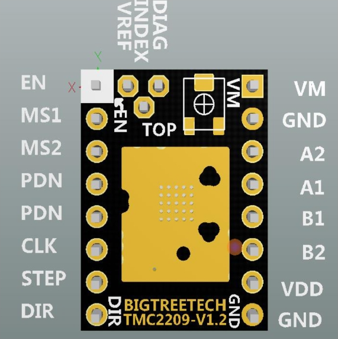
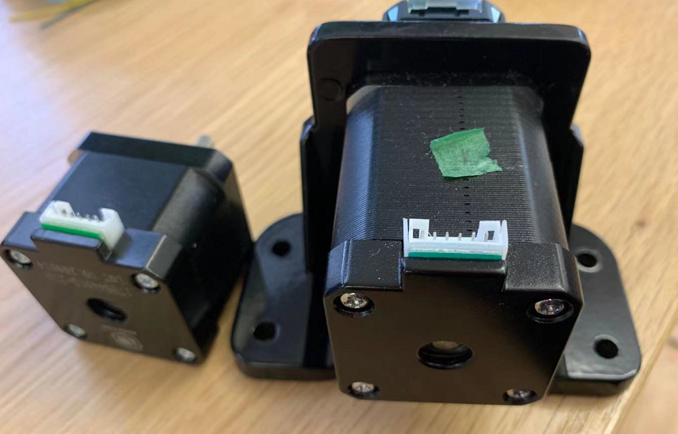
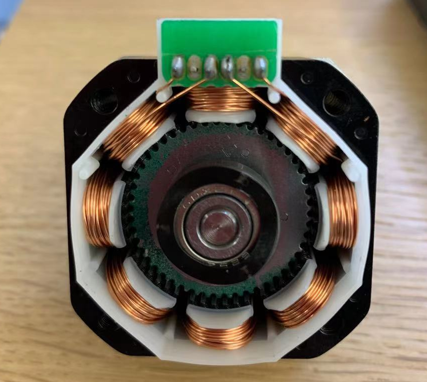
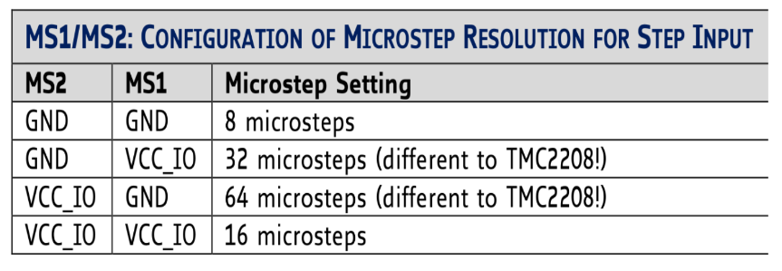

# **Stepper motor**

[Stepper motor types from ITP physical computing site](https://vimeo.com/380417082?embedded=true&source=vimeo_logo&owner=3661860)

## **4/6 wire steppers how to wire it to stepper driver?**

---

A typical stepper motor would have 4 wires. Some might have 6 wires. But to use it with our drivers, we can just use 4 wires of the stepper motor.

- **4 wire stepepr motor**


- **6 wire stepper motor**

Or it might be a 6 wire with the two center taps tied together.


- **8 wire stepper motor**

See this tutorial here: [connecting stepper motors with different numbers of wires](https://www.pololu.com/docs/0J71/4.2)

When we use a bipolar stepper driver, we can see its pin configuration usually like this:



So A1 A2 should be connected to A+ A-, B1 B2 should be connected to B+ B-. According to my experience, the only thing matters is that you should pair them right. The polarity doesn’t matter.

<p>&nbsp;</p>

**How do we know the stepper motor A1 A2 B1 B2 pins of a stepper motor?**

Sometimes, the stepper motors are manufactured with different standard and the order of the wire can be totally different. For example, the stepper motor I have and the stepper motor Jason gave me looks similar, and they can use the same mount, but they are wired differently. 



**So I use a multimeter!** The coil A is not connected with coil B in a bipolar stepper motor. If you measure the 2 resistance of coil A1 and coil A2, it should be very small. In this case, the resistance is just 3.2 Ω.

Or we can tear it down.



Or we can spin the motor. (credit [here](https://www.makerguides.com/tb6600-stepper-motor-driver-arduino-tutorial/))

To find the two wires from one coil, do the following with the motor disconnected:

- Try to spin the shaft of the stepper motor by hand and notice how hard it is to turn.

- Now pick a random pair of wires from the motor and touch the bare ends together.

- Next, while holding the ends together, try to spin the shaft of the stepper motor again.

If you feel a lot of resistance, you have found a pair of wires from the same coil. If you can still spin the shaft freely, try another pair of wires. Now connect the two coils to the pins shown in the wiring diagram above.

<p>&nbsp;</p>

## **A very popular and cheap stepper motor driver, A4988**

---


### **Step 1: figure out the Vref**

Vref is a voltage reference that would correspond to the maxinum current that will flow to your stepper motor.

We need to use a screw driver to adjust the small screw on our board and measure the voltage from Vref to Ground. 

Also, before measure, we need to connect the external power supply to the stepper motor driver. For this stepper driver, we just need to connect VCC. 


**Formula is:**


**Sense resistor value**

Our Sense resistor value is 110 Ω in this case. We can find it out by examine our motor driver.

Note that this formula works for both TMC2209 and TMC2208.

Foe A4988 driver, Vref= 8 * Max current of a stepper motor * Sense resistor value.

let's suppose we are using this stepper motor [stepper motor from pololu](https://www.pololu.com/product/1204)

**Max current of a stepper motor**

Current rating: 600 mA per coil

Voltage rating: 3.9 V

When we look at the parameters for a stepper motor, it would says a rated voltage and current. For this stepper motor, it would drive 600 mA under 3.9V. Unlike dc motors, stepper motors can operate under higher voltage if we use stepper motor driver. Stepper motors are designed to work this way and it is safe to run the motors at up to 20 times the rated voltage.  You will actually get better performance by running at a higher voltage than the rated voltage. If you hook it up to to 12V, for example, the motor while attempt to draw more current, but the stepper motor driver will not allow that to happen and use high frequency pulses to limit the average current to the desired maximum value.

Our max current is 600 mA. 

So the Vref we desired should be around 0.5V. Use a screw driver to adjust the value until we measure the Vref to be 0.5V. Clockwise for reduce Vref and Counter-clockwise to increase.

Additional Video: [Pololu stepper motor set Vref tutorial] (https://youtu.be/89BHS9hfSUk)

<p>&nbsp;</p>

### **Step 2: Schematics**




I left the MS1 and MS2 not connected, their default value is pulled down to be low. So it is 1/8 microstep. Our stepper is 1.8 degree step angle, which means 200 steps per revolution. Stepper motors typically have a step size of 1.8° or 200 steps per revolution, this refers to full steps. So the steps we need to complete a revolution is 1600 steps.

<p>&nbsp;</p>

### **Step 3: Code**

**Direction Pin**

When Direction pin is high, the stepper motor would rotate clockwise. When its low, it would rotate counter-clockwise

```
{
    // Set the spinning direction clockwise:
    digitalWrite(dirPin, HIGH);
}
```

**Stepper Pin**

To make a step motor rotate one step, we need to create one pulse on the stepper pin.

```
{
    // these four lines would result in the stepper motor to rotate 1 microstep, it creates one pulse
    digitalWrite(stepPin, HIGH);
    delayMicroseconds(1000);
    digitalWrite(stepPin, LOW);
    delayMicroseconds(1000);
}
```

To make a step motor rotate one revolution, we repeat it 1600 times, which is the number of steps it needs for a full revolution.

```
{
    //stepper would rotate clockwise for one revolution
    digitalWrite(dirPin, HIGH);
    for (int i = 0; i < stepsPerRevolution; i++) {
        digitalWrite(stepPin, HIGH);
        delayMicroseconds(1000+i);
        digitalWrite(stepPin, LOW);
        delayMicroseconds(1000+i);
    }
}
```

By changing the parameters for delayMicroseconds, we can have fun by controlling stepper speed.

Example code found here [code](/stepper_motor_code/stepper_motor_Dir___Step.ino)

<p>&nbsp;</p>