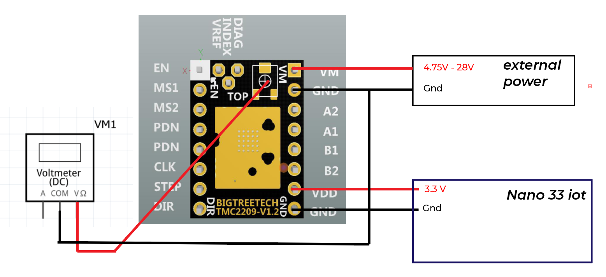
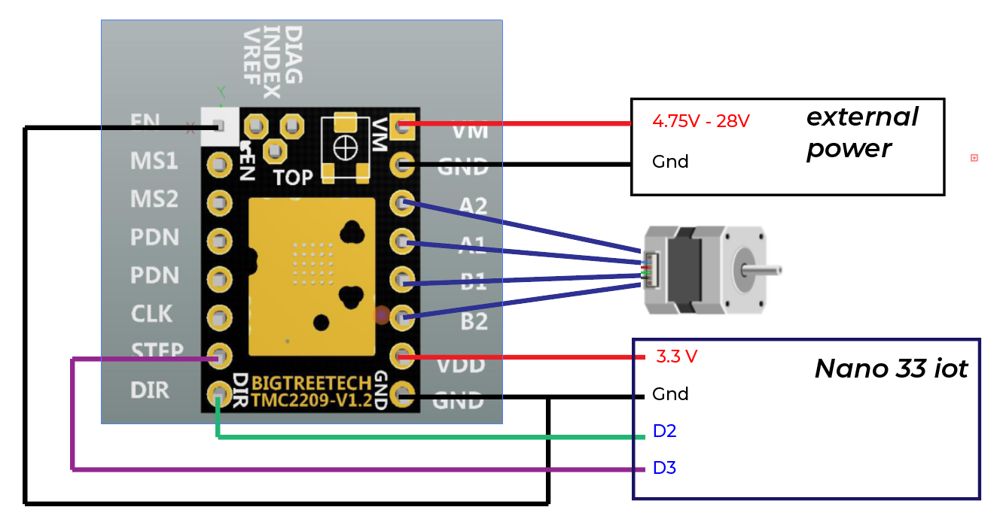
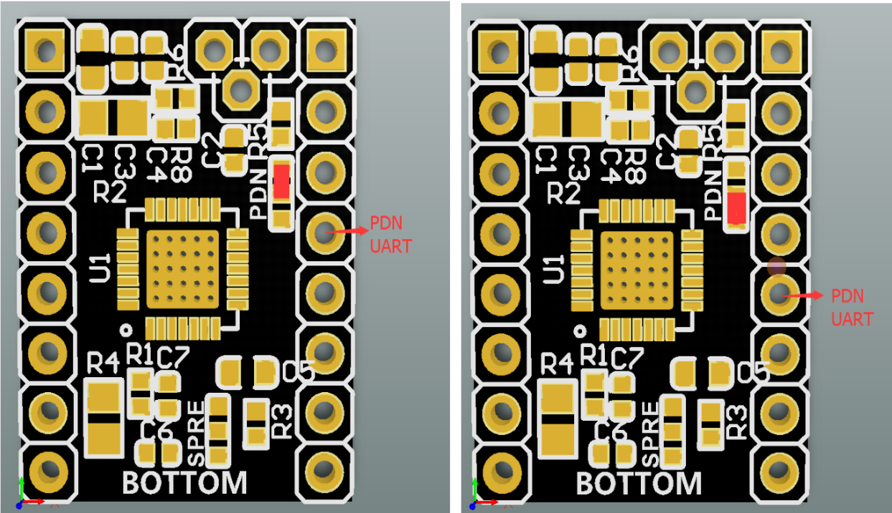
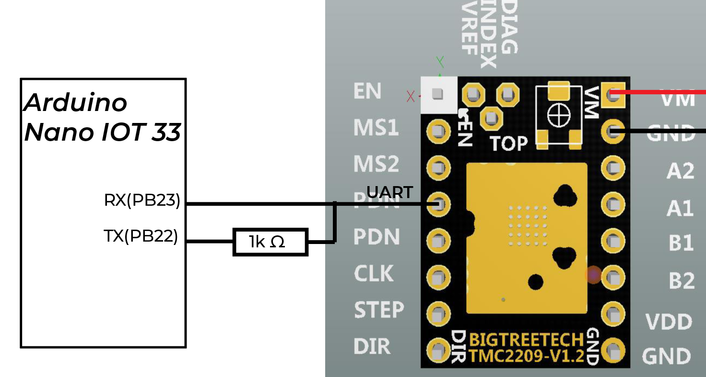
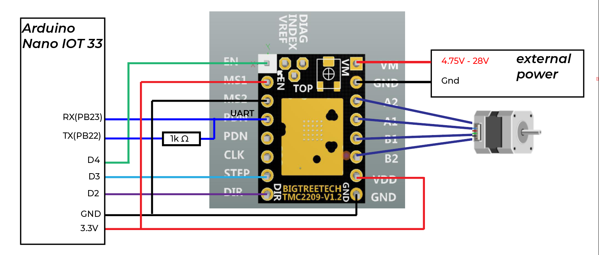
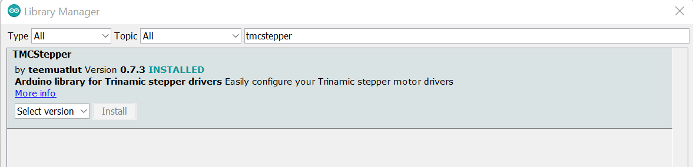
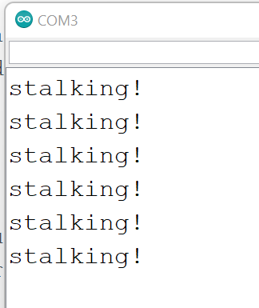
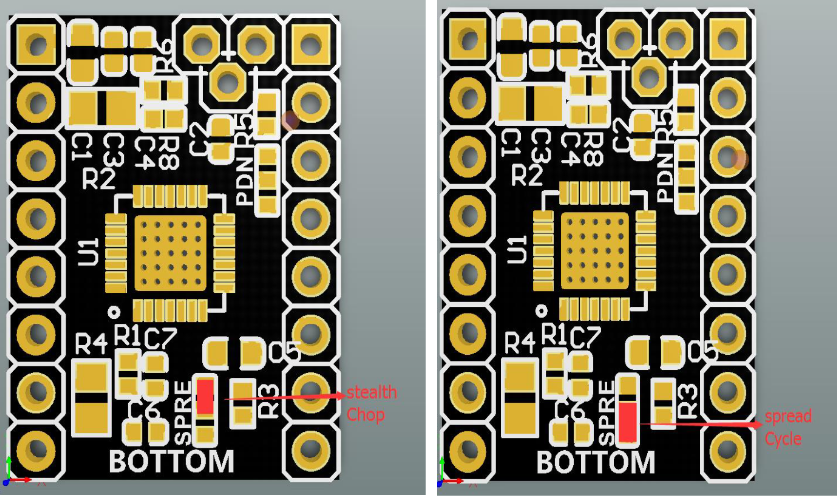

# **Stepper motor**

[Stepper motor types from ITP physical computing site](https://vimeo.com/380417082?embedded=true&source=vimeo_logo&owner=3661860)

## **4/6 wire steppers how to wire it to stepper driver?**

---

A typical stepper motor would have 4 wires. Some might have 6 wires. But to use it with our drivers, we can just use 4 wires of the stepper motor.

- **4 wire stepepr motor**


- **6 wire stepper motor**

Or it might be a 6 wire with the two center taps tied together.


- **8 wire stepper motor**

See this tutorial here: [connecting stepper motors with different numbers of wires](https://www.pololu.com/docs/0J71/4.2)

When we use a bipolar stepper driver, we can see its pin configuration usually like this:


So A1 A2 should be connected to A+ A-, B1 B2 should be connected to B+ B-. According to my experience, the only thing matters is that you should pair them right. The polarity doesn’t matter.

<p>&nbsp;</p>

**How do we know the stepper motor A1 A2 B1 B2 pins of a stepper motor?**

Sometimes, the stepper motors are manufactured with different standard and the order of the wire can be totally different. For example, the stepper motor I have and the stepper motor Jason gave me looks similar, and they can use the same mount, but they are wired differently. 


**So I use a multimeter!** The coil A is not connected with coil B in a bipolar stepper motor. If you measure the 2 resistance of coil A1 and coil A2, it should be very small. In this case, the resistance is just 3.2 Ω.

Or we can tear it down.


Or we can spin the motor. (credit [here](https://www.makerguides.com/tb6600-stepper-motor-driver-arduino-tutorial/))

To find the two wires from one coil, do the following with the motor disconnected:

- Try to spin the shaft of the stepper motor by hand and notice how hard it is to turn.

- Now pick a random pair of wires from the motor and touch the bare ends together.

- Next, while holding the ends together, try to spin the shaft of the stepper motor again.

If you feel a lot of resistance, you have found a pair of wires from the same coil. If you can still spin the shaft freely, try another pair of wires. Now connect the two coils to the pins shown in the wiring diagram above.

<p>&nbsp;</p>

## **A very popular and cheap stepper motor driver, A4988**

---


### **Step 1: figure out the Vref**

Vref is a voltage reference that would correspond to the maxinum current that will flow to your stepper motor.

We need to use a screw driver to adjust the small screw on our board and measure the voltage from Vref to Ground. 

Also, before measure, we need to connect the external power supply to the stepper motor driver. For this stepper driver, we just need to connect VCC. 




**Formula is:**


**Sense resistor value**

Our Sense resistor value is 110 Ω in this case. We can find it out by examine our motor driver.

Note that this formula works for both TMC2209 and TMC2208.

Foe A4988 driver, Vref= 8 * Max current of a stepper motor * Sense resistor value.

let's suppose we are using this stepper motor [stepper motor from pololu](https://www.pololu.com/product/1204)

**Max current of a stepper motor**

Current rating: 600 mA per coil

Voltage rating: 3.9 V

When we look at the parameters for a stepper motor, it would says a rated voltage and current. For this stepper motor, it would drive 600 mA under 3.9V. Unlike dc motors, stepper motors can operate under higher voltage if we use stepper motor driver. Stepper motors are designed to work this way and it is safe to run the motors at up to 20 times the rated voltage.  You will actually get better performance by running at a higher voltage than the rated voltage. If you hook it up to to 12V, for example, the motor while attempt to draw more current, but the stepper motor driver will not allow that to happen and use high frequency pulses to limit the average current to the desired maximum value.

Our max current is 600 mA. 

So the Vref we desired should be around 0.5V. Use a screw driver to adjust the value until we measure the Vref to be 0.5V. Clockwise for reduce Vref and Counter-clockwise to increase.

Additional Video: [Pololu stepper motor set Vref tutorial] (https://youtu.be/89BHS9hfSUk)

<p>&nbsp;</p>

### **Step 2: Schematics**





I left the MS1 and MS2 not connected, their default value is pulled down to be low. So it is 1/8 microstep. Our stepper is 1.8 degree step angle, which means 200 steps per revolution. Stepper motors typically have a step size of 1.8° or 200 steps per revolution, this refers to full steps. So the steps we need to complete a revolution is 1600 steps.

<p>&nbsp;</p>

### **Step 3: Code**

**Direction Pin**

When Direction pin is high, the stepper motor would rotate clockwise. When its low, it would rotate counter-clockwise

```
{
    // Set the spinning direction clockwise:
    digitalWrite(dirPin, HIGH);
}
```

**Stepper Pin**

To make a step motor rotate one step, we need to create one pulse on the stepper pin.

```
{
    // these four lines would result in the stepper motor to rotate 1 microstep, it creates one pulse
    digitalWrite(stepPin, HIGH);
    delayMicroseconds(1000);
    digitalWrite(stepPin, LOW);
    delayMicroseconds(1000);
}
```

To make a step motor rotate one revolution, we repeat it 1600 times, which is the number of steps it needs for a full revolution.

```
{
    //stepper would rotate clockwise for one revolution
    digitalWrite(dirPin, HIGH);
    for (int i = 0; i < stepsPerRevolution; i++) {
        digitalWrite(stepPin, HIGH);
        delayMicroseconds(1000+i);
        digitalWrite(stepPin, LOW);
        delayMicroseconds(1000+i);
    }
}
```

By changing the parameters for delayMicroseconds, we can have fun by controlling stepper speed.

Example code found here [code](/stepper_motor_code/stepper_motor_Dir___Step.ino)

<p>&nbsp;</p>

## use it in UART mode: Active Step/Dir mode

---

You don't have to fiddle with jumpers to set your micro-steps, just change it in the firmware, and you can dynamically change the amount of current going to each stepper motor (no more adjusting that small potentiometer on the driver board). Also, you can use other cool functions in this mode. For example, switching from stealthchop mode to spreadcycle. Motor stalk detection and so on...

If you are using a TMC2208 board, you could look at this article: [UART TMC2208](https://www.instructables.com/UART-This-Serial-Control-of-Stepper-Motors-With-th/)

### **Step 1: look at your firmware to see which pin is UART**



 The center pad is the direct connection back to the TMC2209 chip UART pin. The two pads on either side connect directly to the header pin they are closest to. The silkscreen side of the board has these two header pins labeled collectively as PDN UART.

 The ones I got from Amazon is soldered like the image on the left. So the UART pin is the one next to the pin MS2.

<p>&nbsp;</p>


### **Step 2: connect UART to Arduino**



There needs to be a one wire connection from the UART pin on the SilentStepStick. That one wire then splits into two lines (Rx and Tx) for connection to the Arduino Nano IOT 33, with the Tx (transmit) connection being made through a 1K Ohm resistor.

<p>&nbsp;</p>


### **Step 3: Driver Address**


The Driver address is specified by the physical pin state of MS1 and MS2 pin. MS1 being bit 0 (LSB) and MS 2 being bit 1. Therefore by pulling ms1 low and ms2 high, the address for that driver would be 0b10.

<p>&nbsp;</p>

### **Step 4: Circuit**



```
{
    #define EN_PIN           4 // Enable
    #define DIR_PIN          2 // Direction
    #define STEP_PIN         3 // Step
}
```

<p>&nbsp;</p>

### **Step 5: Code**

First of all, install the TMCSTEPPER library.



To start the Hardware Serial communication..

```
{
    #define SERIAL_PORT Serial1 // TMC2208/TMC2224 HardwareSerial port
    #define DRIVER_ADDRESS 0b10 // TMC2209 Driver address according to MS1 and MS2
    TMC2209Stepper driver(&SERIAL_PORT, R_SENSE, DRIVER_ADDRESS);
}
```
We can dynamicly change the microstepper, current limit...

```
{
    driver.rms_current(1000);        // Set motor RMS current
    driver.microsteps(32);          // Set microsteps to 1/32th
}
```

Change direction by changing the boolean called shaft

```
{
    shaft = !shaft;
    driver.shaft(shaft);
}
```

To use spreadCycle mode:

```
{
    driver.en_spreadCycle(true);
}
```

To use stealthchop(silent) mode:

```
{
    driver.pwm_autoscale(true);
}
```

<p>&nbsp;</p>

### **Step 6: Stalk Detection**

I connect D9(one of the interrupt pin on Arduino Nano IOT 33 board) to the Diag Pin.

```
{
    #define interruptPin     9
    void setup() {
        attachInterrupt(digitalPinToInterrupt(interruptPin), diagnose, CHANGE);
    }
    void diagnose(){
    Serial.println("stalking!");
    }
}
```

And we can set the stalk_Value. See the datasheet 5.3 chapter for more information about the parameters... (datasheet)[https://www.trinamic.com/fileadmin/assets/Products/ICs_Documents/TMC2209_Datasheet_V103.pdf]

```
{
    #define STALL_VALUE 150
    void setup() {
        driver.TCOOLTHRS(0xFFFFF); // TCOOLTHRS: This is the lower threshold velocity for switching on smart energy CoolStep and StallGuard to DIAG output. (unsigned)Set this parameter to disable CoolStep at low speeds, where it cannot work reliably. The stall output signal become enabled when exceeding this velocity. It becomes disabled again once the velocity falls below this threshold.
        driver.semin(5);  // [0... 15] If the StallGuard4 result falls below SEMIN*32, the motor current becomes increased to reduce motor load angle.
        driver.semax(5);  // [0... 15]  If the StallGuard4 result is equal to or above (SEMIN+SEMAX+1)*32, the motor current becomes decreased to save energy.
        driver.sedn(0b01);  // current down step speed 0-11%
        driver.SGTHRS(STALL_VALUE);
    }
}
```
So we can see the result when our stepper motor is stalking...



The overall code can be found here .... [all the code...](stepper_motor_code/tm2209_uart_mode.ino)

<p>&nbsp;</p>

## **why it is silent: StealthChop & SpreadCycle**

---

For this one I bought from Amazon, it is set to StealthChop already. So if you use it as a A4988, it would be quiet.



[stealthchop and spreadcycle explained](https://youtu.be/Q0sJlGh9WNY)

StealthChop is a quiet mode of operation for stepper motors at standstill and at low velocities. It is based on a voltage mode PWM. 

While stealthChop is a voltage mode PWM controlled chopper, spreadCycle is a cycle-by-cycle current control. It can react extremely fast to changes in motor velocity or motor load. spreadCycle will give better performance in medium to high velocity range for motors and applications which tend to resonance.

<p>&nbsp;</p>

<p>&nbsp;</p>

## debugging tips:

If your motor is making weird noise and it rotates back and forth quickly, you might need to change the wiring of stepper motor.

If your stepper motor driver/ stepper motor is heated up. Make the Vref lower.

If your stepper cannot rotate but when you touch it, it seems to be vibrating.. Make the Vref bigger.

TMC series drivers pin can be very different. Even the same TMC2209 might have different pin configuration for different version. THe Vref, Diag and Index are the ones that are most likely to change.

<p>&nbsp;</p>

## other stepper motor drivers

**TMC2208 V1.x**

[Pin configuration](https://learn.watterott.com/silentstepstick/pinconfig/tmc2208/)

can only use stealthchop mode too without using UART.

Basically is the same as TMC2209 V1.2 when use Step/Dir. It is said that TMC2209 has stalk detection while TMC2208 does not. 

Also, the TMC2208 I got UART pin is not soldered yet... By default, the UART pin on the Trinamic TMC2208 chip is not connected to the header pin(s) of the Watterott SilentStepStick.  If we want to do UART control using TMC2208,  you can either solder the center pad to the up or down pad, or to both.  


and then you can follow the TMC2209 tutorial to use it. Note that it does not offer stalk detection.

<p>&nbsp;</p>

**SSTSPIN220**

Just need to follow this Pololu Tutorial

[Pololu Tutorial](https://www.pololu.com/product/2876)

I follow the wiring. 


And I adjust the Vref because the formula this time is Vref= Current Limit / 5.

I use the example code here: 

[Example code for using SSTSPIN220](https://github.com/pranav083/Stepper_STSPIN220-library)

The result is that the stepper motor would have some noise but because it can microstep 1/256 step, the noise is not so noticable.

<p>&nbsp;</p>

## **Unipolar steppers**

---

- **5 wire stepepr motor**

A 5 wire motor might just be a 4 wire motor with a frame-ground connection. 


## **credit**

This tutorial is based on [Seansadler on Instructable: Uart TMC2208](https://www.instructables.com/UART-This-Serial-Control-of-Stepper-Motors-With-th/)

[Tomdixo's question and solution of TMC2209 UART address](https://forum.arduino.cc/t/solved-slave-address-tmc2209-uart/693615)